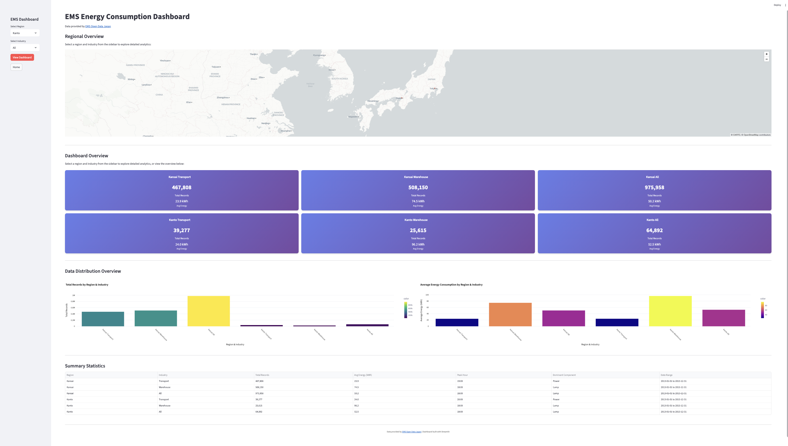
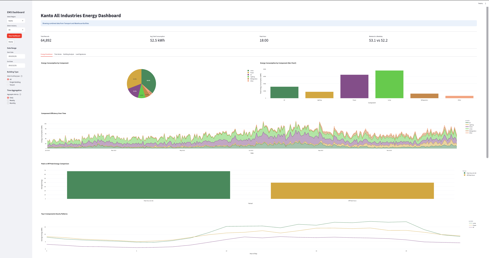
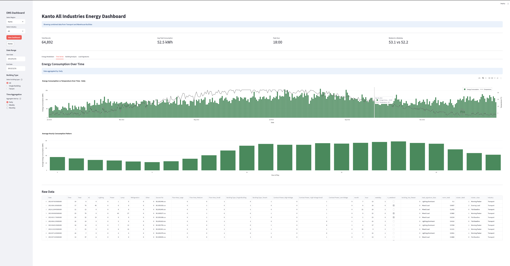
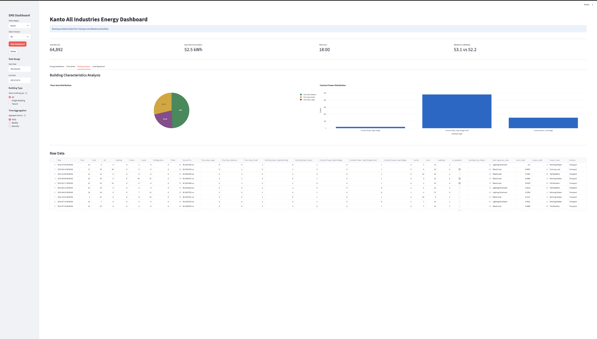
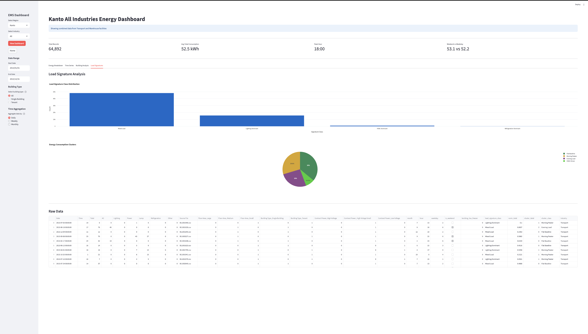

# EMS Energy Consumption Dashboard

An interactive Energy Management System dashboard built with Streamlit for analyzing energy consumption data across Kansai and Kanto regions in Japan.

## 🚀 Live Application
**[Try the dashboard here: https://ems-dashboard-4rub8dnetz7ddccxxt6g5a.streamlit.app/](https://ems-dashboard-4rub8dnetz7ddccxxt6g5a.streamlit.app/)**

## 📊 Screenshots

### Landing Page


### Energy Breakdown Analysis


### Time Series Analysis


### Building Analysis


### Load Signatures


## ✨ Features

- **Interactive Map**: Visual representation of Japan with highlighted regions
- **Regional Analysis**: Transport, Warehouse, or combined All industries
- **Comprehensive Visualizations**: Energy breakdown, time series, building analysis, load signatures
- **Interactive Filtering**: Date range, building type, and time aggregation filters
- **Real-time Data**: Live data loading with performance optimization

## 🛠️ Quick Start

```bash
git clone <repository-url>
cd ems_opensource
uv sync
streamlit run main.py
```

## 📁 Project Structure

```
ems_opensource/
├── main.py                    # Main application
├── src/dashboard/             # Dashboard components  
├── data/processed/            # Parquet data files
└── dashboard_img/             # Screenshots
```

## 📊 Data Source

Data from [EMS Open Data Japan](https://www.ems-opendata.jp/) - Sustainable open Innovation Initiative (SII)

## 🚀 Deployment

Optimized for Streamlit Cloud with lazy loading and memory optimization.